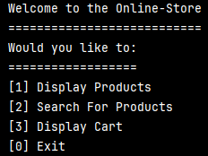
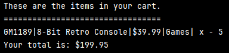
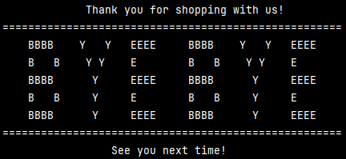
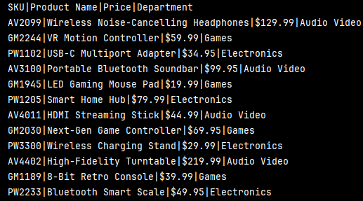
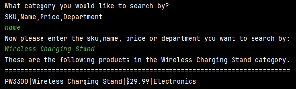
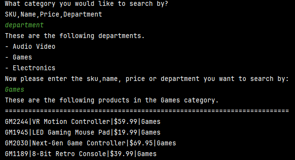
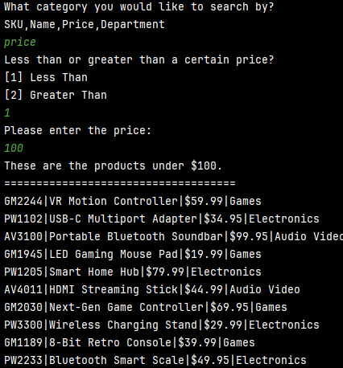
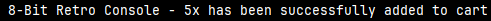
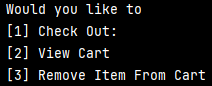
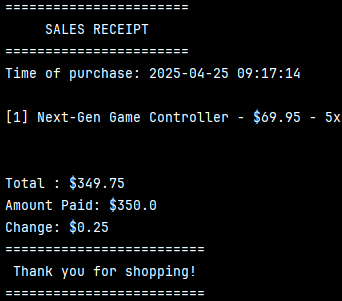

# 🛍️ Online Store - CLI Application
#### By: Kenny Lin

---

Welcome to the **Online Store** workshop project! This is a command-line application built by Kenny Lin to simulate an online shopping experience using a text-based interface.

## 📁 Project Structure

This repository contains a simple CLI-based store front that allows users to:

- 🛒 Browse and search a catalog of products
- ➕➖ Add or remove products from their cart
- 💳🧾 Check out and receive a sales receipt

The store uses a `products.csv` file as its inventory source.

## 📦 Features

### Core Functionality
- 📥 Load product inventory from a CSV file
- 🛍️ View all available products
- 🔍 Search products by:
    - 🏷️ Name
    - 💲 Price
    - 🏢 Department
- ➕➖ Add/remove items from the cart
- 🛒 View cart with line items and total cost

### Interface Screens
- **🏠 Home Screen**
  - 🛍️ Display Products
  
  

  - 🛒 Display Cart
  
  

  - ❌ Exit
  
  

- **🛒 Display Products**
  - 🏬 View full inventory
  
  
    
  - 🔎 Search or filter by product name/sku
  
  
  
  - 🔎 Search or filter by departments available
  
  

  - 🔎 Search or filter by price (greater than/less than a certain price)
  
  

  - ➕ Add items to the cart
  
  
  - ↩ Return to Home

- **🛍️ Display Cart**
    - 📦 View cart contents and total cost
    - ➖ Remove items
    - 💳 Check out
    - ↩ Return to Home
  
  

### ✅ Payment Verification and Receipt Feature
- 💵 Cash-based checkout system
    - 🧾 Validates payment amount
    - 💸 Calculates and displays change
    - 🧾 Prints a sales receipt
    - 🧹 Clears the cart after purchase
  
  

- 🛒 Smart cart quantity management
    - 📦 Same items are grouped with quantity shown
- 📝 Receipt file creation
    - 📂 Saved in a `/Receipts` folder
    - 🕒 Named using a timestamp format (e.g., `202304251148.txt`)

## 🧰 Technologies Used

- 💻 Programming Language: Java
- 🖥️ CLI Interface
- 📄 File I/O (CSV, text file receipts)
- 🛠️ Object-Oriented Design